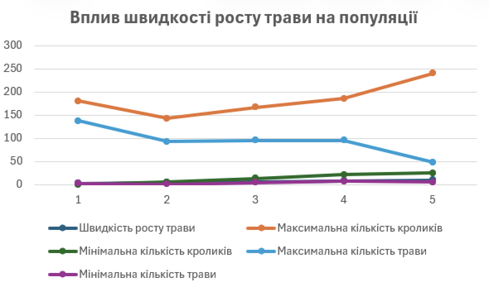

# СПм-24-1 Хомутов Д. О.
  
## Лабораторна робота №1. Опис імітаційних моделей та проведення обчислювальних експериментів
## Варіант №6
### Опис моделі 
Дана модель досліджує екосистеми типу «хижак-жертва». Такий тип системи може бути стабільним та нестабільним. В нестабільній системі з часом один або декілька видів вимирають, натомість в стабільній системі види співіснують протягом значних проміжків часу.

### Параметри
1. number - початкова кількість кроликів;
2. birth-threshold - порогова кількість енергії кролика для репродукції;
3. grass-grow-rate - швидкість росту трави;
4. grass-energy - кількість енергії, яку отримує кролик від трави;
5. weeds-grow-rate - швидкість росту бур'янів;
6. weed-energy - кількість енергії, яку отримує кролик від бур'янів.

### Показники роботи моделі
1. Мінімальна та максимальна кількість кроликів за час симуляції;
2. Мінімальна та максимальна кількість трави за час симуляції;
4. Стабільність екосистеми - період часу, протягом якого кролики існують;
5. Фаза циклу "хижак-жертва" - момент, коли кількість кроликів перевищує кількість трави, що свідчить про перехід до наступної фази циклу.

### Алгоритм зміни станів моделі
Кролики рандомно блукают полем у пошуку трави. Кожен крок коштує їм енергії.
Енергію кролик отримує, коли їсть траву. Якщо його енергія досягає нуля, він помирає.
Якщо його енегрія досягає порогу для народження, відбувається репродукція, 
при цьому репродукція коштує кролику половини його поточної енергії.
Трава в цей час рандомно росте на полі. Бур'ян працює таким самим чином, як трава,
Але згідно власних параметрів.

### Недоліки моделі
Недоліком моделі є велика спрощеність моделі відносно реальності. Вона показує лише
невелику частину харчового ланцюга, через що її репрезентативність процесів реальних
екосистем є не такою великою. Не дивлячись на це, модель дає гарне розуміння процесів
в екосистемах (наприклад, циклів популяції) у спрощеному вигляді.

### Експерименти
#### 1. Вплив початкової кількості кроликів на популяції кроликів і трави

Досліджується вплив початкової кількості кроликів на поведінку моделі. Тривалість експерименту 500 тактів.
Змінним параметром є number.
- birth-threshold = 15
- grass-growth-rate = 15
- grass-energy = 5
- weeds-growth-rate = 0
- weed-energy = 0

<table>
<thead>
<tr><th>Кількість кроликів</th><th>Максимальна кількість кроликів</th><th>Мінімальна кількість кроликів</th><th>Максимальна кількість трави</th><th>Мінімальна кількість трави</th></tr>
</thead>
<tbody>
<tr><td>10</td><td>400</td><td>3</td><td>151</td><td>6</td></tr>
<tr><td>110</td><td>310</td><td>52</td><td>100</td><td>7</td></tr>
<tr><td>210</td><td>277</td><td>110</td><td>64</td><td>4</td></tr>
<tr><td>310</td><td>310</td><td>126</td><td>64</td><td>7</td></tr>
<tr><td>410</td><td>410</td><td>170</td><td>48</td><td>6</td></tr>
</tbody>
</table>

Початкова кількість кроликів в основному має вплив на стан моделі на початку симуляції, після приблизно 100-120 кроків система стабілізується на популяції кроликів 230-250 та популяції трави 45-50 з невеликими осиляціями. За перші 100 кроків:
- за невеликої початкової кількості популяція кроликів трава на перших кроках має можливість розростись, що призводить до різкого зростання популяції кроликів, далі йде пара великих осиляцій популяції з подальшою стабілізацією;
- велика початкова кількість кроликів призводить до вимирання більшості популяції на перших кроках, поки трава не розростеться до кількості, до дозволяє підтримувати популяцію кроликів на стабільному рівні.

#### 2. Вплив швидкості росту трави на популяції
Досліджується вплив початкової кількості кроликів на популяції. Тривалість експерименту 300 тактів.
Змінним параметром є grass-growth-rate.
- number = 50
- birth-threshold = 15
- grass-growth-rate = 15
- grass-energy = 5
- weeds-growth-rate = 0
- weed-energy = 0

<table>
<thead>
<tr><th>Швидкість росту трави</th><th>Максимальна кількість кроликів</th><th>Мінімальна кількість кроликів</th><th>Максимальна кількість трави</th><th>Мінімальна кількість трави</th></tr>
</thead>
<tbody>
<tr><td>2</td><td>180</td><td>0</td><td>137</td><td>2</td></tr>
<tr><td>4</td><td>143</td><td>5</td><td>93</td><td>1</td></tr>
<tr><td>6</td><td>167</td><td>13</td><td>95</td><td>4</td></tr>
<tr><td>8</td><td>186</td><td>21</td><td>95</td><td>7</td></tr>
<tr><td>10</td><td>240</td><td>25</td><td>48</td><td>5</td></tr>
</tbody>
</table>

При значенні швидкості 2 систена стає нестабільною, в приблизно 80% прогонів кролики
вимирають за 30-60 кроків, у інших випадках популяції кроликів і трави входять в цикл
з осиляціями середньої амплітуди.
За вищих значень швидкості поведінка системи нагадує перший експеримент: спочатку
кількість кроликів значно падає, за цей час трава розростається, що призводить до "буму"
популяції кроликів з подальшою стабілізацією популяцій з дуже невеликими осиляціями.
Чим вище швидкість росту, тим вища середня популяція кроликів після ствбілізації,
натомість середня популяція трави залишається ~40 незалежно від швидкості.

#### 3. Вплив бур'янів на популяції кроликів та трави

Досліджується вплив росту бур'янів на систему.Тривалість експерименту 300 тактів.
Змінним параметром є weeds-growth-rate.
- number = 50
- birth-threshold = 15
- grass-growth-rate = 3
- grass-energy = 5
- weed-energy = 0.5

<table>
<thead>
<tr><th>Швидкість росту бур'янів</th><th>Максимальна кількість кроликів</th><th>Мінімальна кількість кроликів</th><th>Максимальна кількість трави</th><th>Мінімальна кількість трави</th></tr>
</thead>
<tbody>
<tr><td>4</td><td>150</td><td>3</td><td>75</td><td>2</td></tr>
<tr><td>8</td><td>80</td><td>5</td><td>65</td><td>2</td></tr>
<tr><td>12</td><td>65</td><td>18</td><td>50</td><td>4</td></tr>
<tr><td>16</td><td>60</td><td>10</td><td>40</td><td>2</td></tr>
<tr><td>20</td><td>60</td><td>9</td><td>41</td><td>1</td></tr>
</tbody>
</table>

Чим вище швидкість росту бур'яну, тим повільніше стає цикл популяцій
кроликів та трави та тим менше середня кількість кроликів після стабілізації популяцій.

