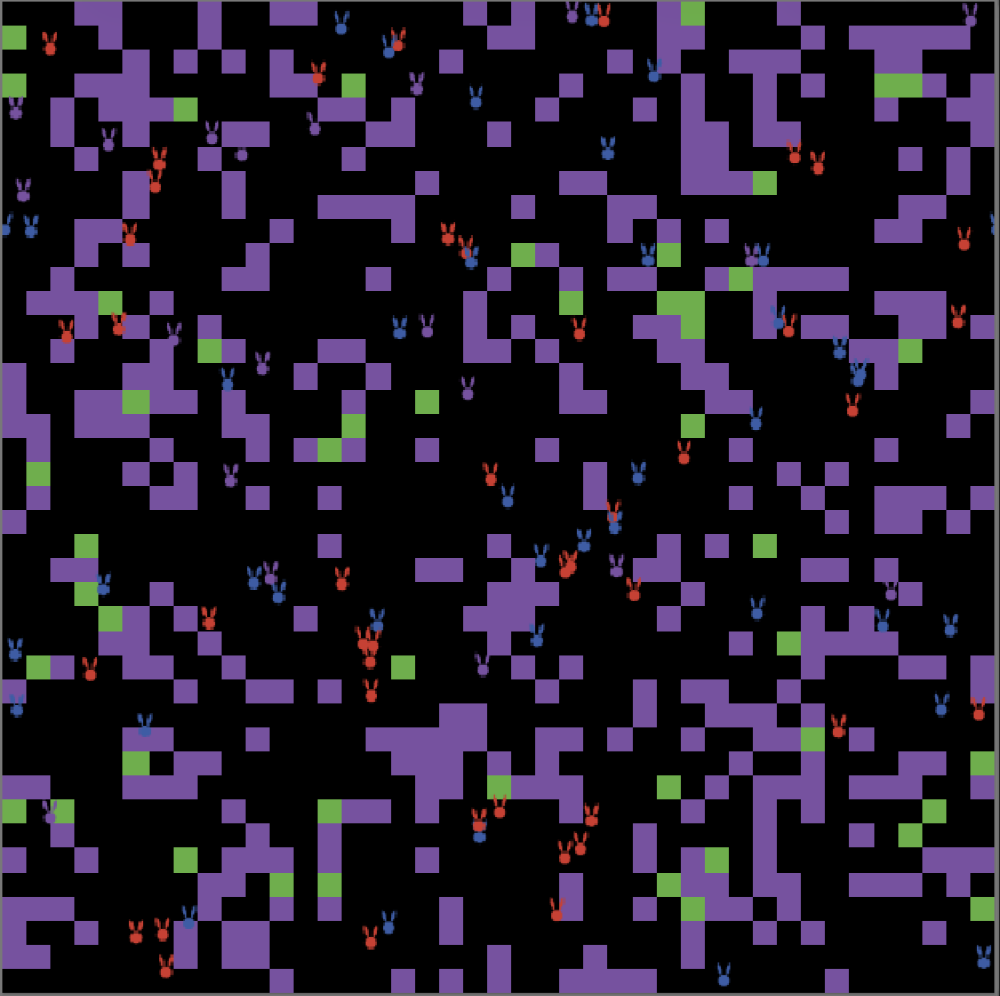
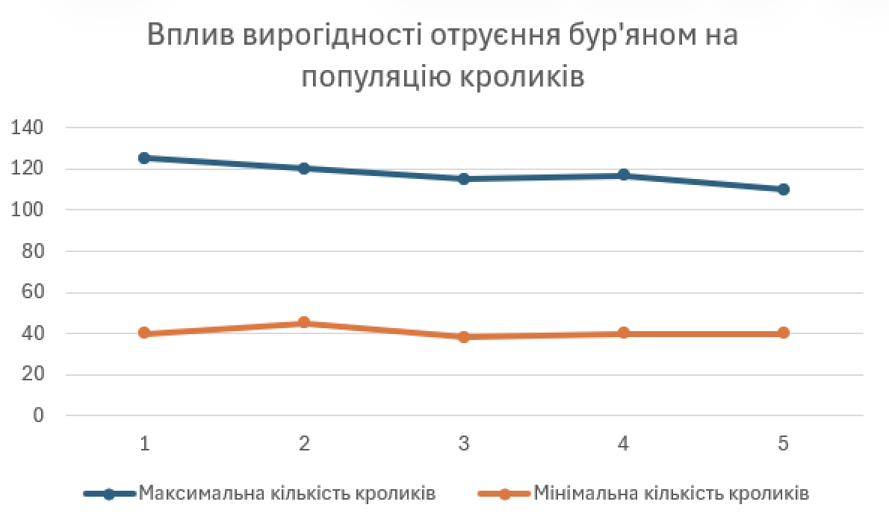

# СПм-24-1 Хомутов Д. О.
  
## Лабораторна робота №2. Редагування імітаційних моделей у середовищі NetLogo
## Варіант №6
Завдання лабораторної роботи полягає у внесенні змін у логіку роботи моделіз ЛР №1 та відстежування впливу змін на роботу симуляції. Згідно варіанту,потрібно внести наступні зміни в модель Rabbits-Grass-Weeds: додати можливість отруїтися при поїданні бур'янів (зазначена у внутрішніх параметрах, як певна вірогідність). Захворілий кролик не може харчуватися, переміщатися і розмножуватися, позначається іншим кольором і залишається хворим на 3 такти модельного часу. Додати поділ кроликів на самців та самок. Поява нових кроликів має вимагати не тільки ситості, а й здоров'я, та присутності в одній із сусідніх клітин іншого ситого здорового кролика протилежної статі. Поява потомства відбувається із ймовірністю 50%.

### Внесення змін у код згідно варіанту
Для додавання отруєння було додано глобальний параметр weed-poisoning-probability та два поля до стану кролика: is-poisoned та ticks-till-healthy. Також було створено процедуру poison-tick та модифіковано процедури eat-weed та move.

``` netlogo
to poison-tick ;; rabbit procedure
  if is-poisoned > 0
  [
    ifelse ticks-till-healthy <= 1
    [
      set is-poisoned 0
      set ticks-till-healthy 0
    ]
    [
      set ticks-till-healthy ticks-till-healthy - 1
    ]
  ]
end

to eat-weeds  ;; rabbit procedure
  ;; gain "weed-energy" by eating weeds
  if pcolor = violet and is-poisoned = 0
  [
    set pcolor black
    set energy energy + weed-energy
    if random 10 = 1
    [
      set is-poisoned 1
      set ticks-till-healthy 3
    ]
  ]
end

to move  ;; rabbit procedure
  if is-poisoned = 0
  [
    rt random 50
    lt random 50
    fd 1
    ;; moving takes some energy
  ]
  set energy energy - 0.5
end
```
Для модифікації функціоналу розмноження було додано поле gender та модифіковано процедуру reproduce.

```netlogo
to reproduce     ;; rabbit procedure
  let neighbouring-rabbits other rabbits in-radius 1
  let my-energy energy
  let my-gender gender
  let my-is-poisoned is-poisoned
  
  ;; give birth to a new rabbit, but it takes lots of energy
  ask neighbouring-rabbits
  [ 
    if gender != my-gender and energy > birth-threshold and my-energy > birth-threshold and is-poisoned = 0 and my-is-poisoned = 0 and random 2 = 1
    [      
        set energy energy / 2
        set my-energy my-energy / 2
        hatch 1 [ fd 1 ]
        stop
    ]
  ]
  set energy my-energy
end
```

Також для кроликів були введені різні кольори для позначення полу та здоров'я.

```netlogo
to set-color
 ifelse is-poisoned > 0
   [set color violet]
   [
     ifelse gender = 0
       [set color blue]
       [set color red]
   ]
end
```

### Внесення змін у код за власним розсудом
У якості власного нововведення було обрано додавання кроликам пошуку партнера після досягання достатньої кількості енергії для розмноження. Також було додано пошук трави поблизу.

```netlogo
to move  ;; rabbit procedure
  if is-poisoned = 0
  [
    let my-gender gender
    let partner one-of other rabbits in-radius 10 with [ gender != my-gender ]
    let grass-patch min-one-of patches in-radius 10 with [pcolor = green] [distance myself]
    
    (ifelse
    energy > birth-threshold and partner != nobody
    [
      face partner
    ]
    grass-patch != nobody
    [
      face grass-patch
    ]
    [
      rt random 50
      lt random 50
    ])

    fd 1
  ]
  set energy energy - 0.5
end
```



### Експеримент для дослідження впливу внесених змін на систему

Для перевірки нового функціоналу дослідимо вплив вирогідності отруєння бур'яном на популяцію кроликів. Експеримент триває 500 тактів.
Змінним параметром є weed-poisoning-probability.
- number = 50
- birth-threshold = 15
- grass-growth-rate = 15
- grass-energy = 5
- weeds-growth-rate = 10
- weed-energy = 0

<table>
<thead>
<tr><th>Вирогідність отруєння бур'яном (%)</th><th>Максимальна кількість кроликів</th><th>Мінімальна кількість кроликів</th></tr>
</thead>
<tbody>
<tr><td>0</td><td>125</td><td>40</td></tr>
<tr><td>25</td><td>120</td><td>45</td></tr>
<tr><td>50</td><td>115</td><td>38</td></tr>
<tr><td>75</td><td>117</td><td>40</td></tr>
<tr><td>100</td><td>110</td><td>40</td></tr>
</tbody>
</table>

Вирогідність отруєння майже не впливає на максимальну та мінімальну популяцію кроликів, але зі збільшенням вирогідності збільшується амплітуда осиляцій при стабілізації системи.


