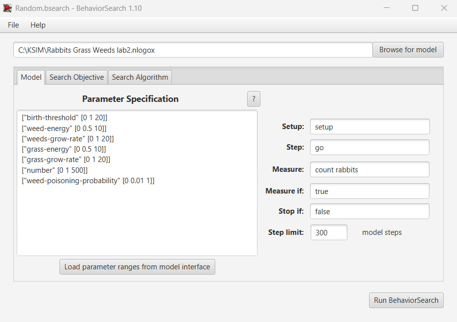
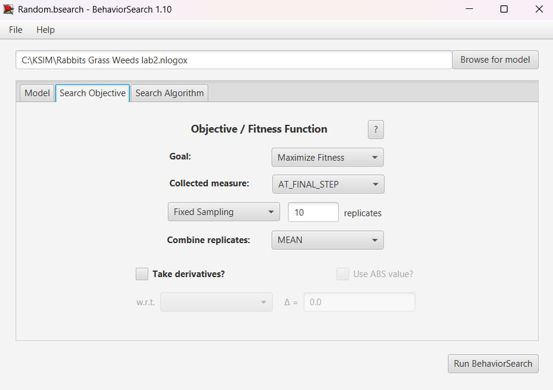
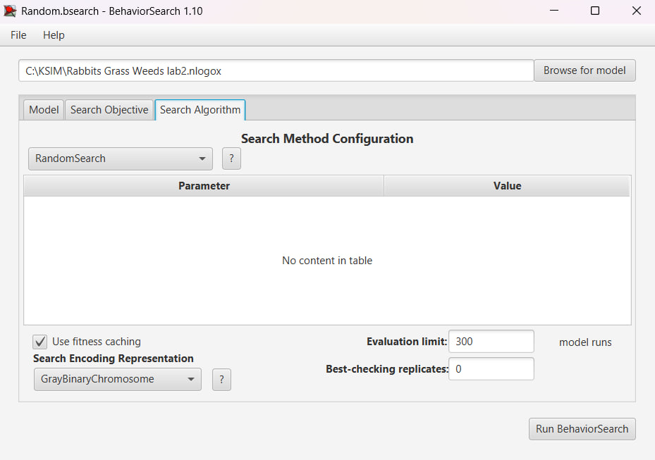
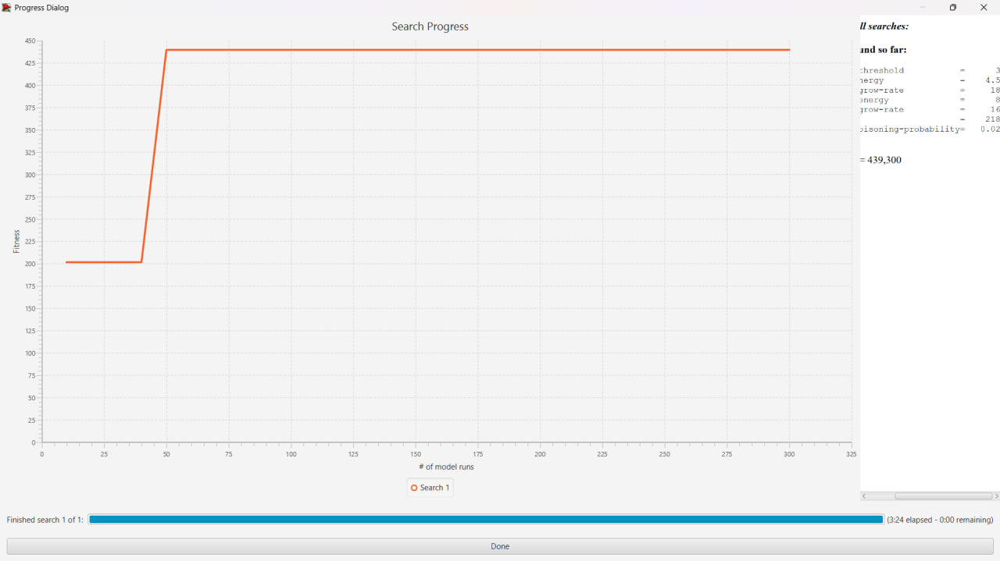
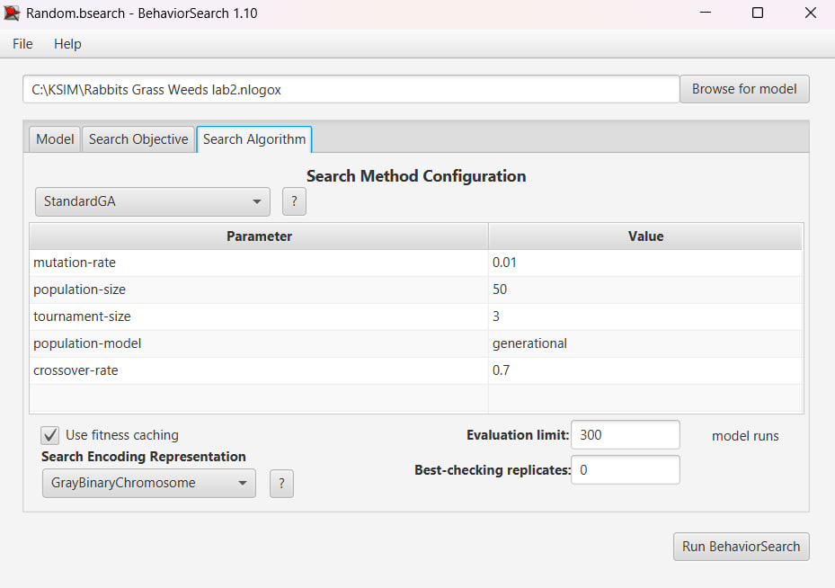
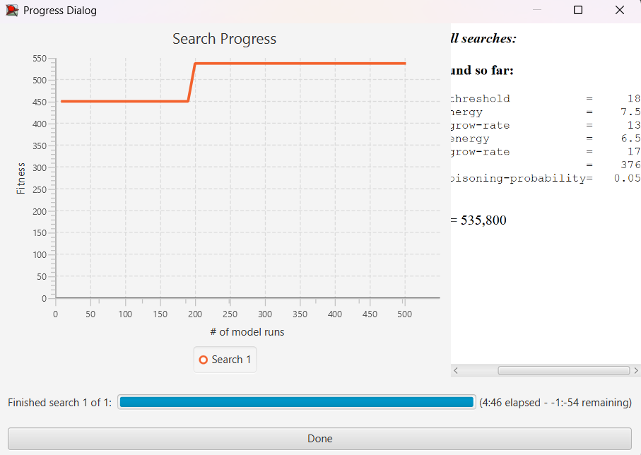
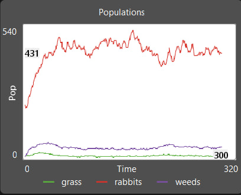
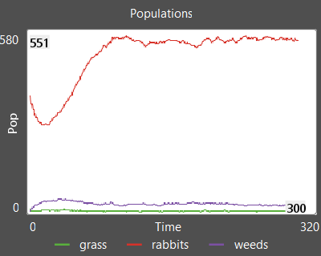

## СПм-24-1 Хомутов Д. О.
## Комп'ютерні системи імітаційного моделювання
## Тема: Лабораторна робота №3. Редагування імітаційних моделей у середовищі NetLogo.

### Налаштування середовища BehaviorSearch
Для пошуку оптимальних параметрів було використано інструмент BehaviorSearch. Метою дослідження є знаходження конфігурації моделі, при якій досягається максимальний рівень популяції кроликів (count rabbits).

Параметри моделі (Model Configuration)
1. number (початкова кількість кроликів) - діапазон [0, 500], крок 1;
2. birth-threshold (порогова кількість енергії кролика для репродукції) - діапазон [0, 20], крок 1;
3. grass-grow-rate (швидкість росту трави) - діапазон [0, 20], крок 1;
4. grass-energy (кількість енергії, яку отримує кролик від трави) - діапазон [0, 10], крок 0.5;
5. weeds-grow-rate (швидкість росту бур'янів) - діапазон [0, 20], крок 1;
6. weed-energy (кількість енергії, яку отримує кролик від бур'янів) - діапазон [0, 10], крок 0.5;
7. weed-poisoning-probability (шанс отруїтися бур'яном) - діапазон [0, 1], крок 0.01;

### Цільова функція (Objective Function)
Показник: count rabbits.
Мета: Максимізація значення.
Значення береться на момент завершення симуляції, 300 тіків.

### Результати дослідження
#### Метод випадкового пошуку (Random Search)
Алгоритм перевіряє випадкові комбінації параметрів у заданому просторі пошуку.

Кількість перевірок: 300.
Найкращий знайдений результат: 439
Знайдені параметри:
birth-threshold: 3
weed-energy: 4.5
weed-growth-rate: 18
grass-energy: 8
grass-growth-rate: 16
number: 218
weed-poisoning-probability: 0.02

#### Генетичний алгоритм (StandardGA)
Використовувався еволюційний підхід, де "популяція" наборів параметрів покращувалася з кожним поколінням через мутації та схрещування.

Параметри ГА: population-size = 50, mutation-rate = 0.01, tournament-size = 3, crossover = 0.7.
Найкращий знайдений результат: 535
Знайдені параметри:
birth-threshold: 18
weed-energy: 7.5
weed-growth-rate: 13
grass-energy: 6.5
grass-growth-rate: 17
number: 376
weed-poisoning-probability: 0.05

### Порівняння результатів
За результатами досліджень можна зробити висновок, що генеративний алгоритм працює краще, ніж випадковий пошук, для знаходження потрібних параметрів моделі.

### Перевірка результатів у NetLogo
Для верифікації отриманих даних, найкращі комбінація параметрів, знайдені обома алгоритмами, були перенесені у середовище NetLogo.

Результат для випадкового пошуку:

Результат для генеративного алгоритму:

Цікавим в результатах є те, що вища порогова кількість енергії для репродукції призводить до вищої популяції кроликів. Це може бути пов'язано з тим, що таким чином не відбувається занадто великих "бумів" народжуваності кроликів, що можуть призводити до дестабілізації системи через те, що така велика кількість кроликів з'їдає занадто велику кількість трави.
